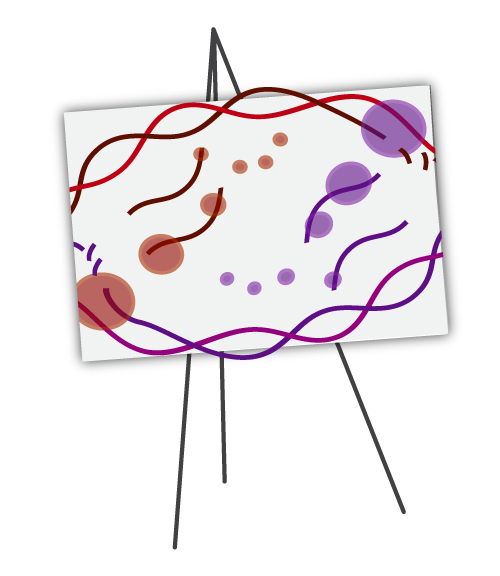

# Escher Web

Version: 1.6.0-beta.4

## Short Description

A web-based visualization tool for biological pathways. 

## Description

Escher is a web-based tool for building, viewing, and sharing visualizations of biological pathways. These 'pathway maps' are a great way to contextualize data about metabolism. It requires manually layouted pathway maps, which can be generated with the same tool starting from an SBML input. This container only includes the standalone web version, and is tailored to produce a dynamic Escher visualization based on fluxomics results.

## Key features

- Biological pathways visualization
- Biological pathways drawing
- Overlay data on top of biological pathways.

## Functionality

- Data overlay on Pathways

## Approaches

- Isotopic Labelling Analysis / 13C

## Screenshots


## Tool Authors

- [Zach King, University of California at San Diego](https://github.com/zakandrewking)

## Container Contributors

- [Pablo Moreno, EMBL-EBI](https://github.com/pcm32) 

## Website

- https://escher.github.io/
- http://escher.readthedocs.io/

## Git Repository

- https://github.com/escher/escher-demo

## Installation

This tool is available by default in all PhenoMeNal Cloud Research Environments (CRE), inside Galaxy. No installation is required when using a CRE or a local deployment of PhenoMeNal.

For advanced docker usage:

- Go to the directory where the dockerfile is.
- Create container from dockerfile:

```
docker build -t escher-fluxomics .
```

Alternatively, pull from repo:

```
docker pull container-registry.phenomenal-h2020.eu/phnmnl/escher-fluxomics
```


## Usage Instructions

The tool is available on each deployed PhenoMeNal Cloud Reseach Environment, inside the Galaxy instance. On the left side tool panel, this is within PhenoMeNal H2020 Tools section, Fluxomics, escher-fluxomics. The tool requires as input a previously layouted map (which can be done with Escher, directions to be added) and the file `Best fit fluxes` produced by Iso2flux or by Isodyn.


Through docker

```
docker run -it -v $PWD:/data container-registry.phenomenal-h2020.eu/phnmnl/escher-fluxomics ...
```

